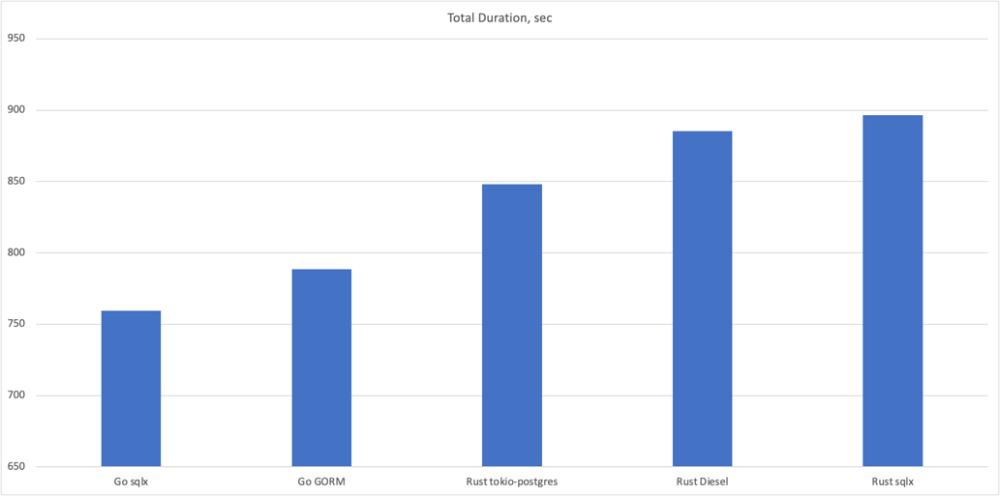

# bench-pg

[](LICENSE)

**bench-pg** is a cross‑language PostgreSQL benchmarking suite designed to measure and compare the performance of
different database driver libraries under a realistic, business‑like workload. It provides two independent
implementations:

- **Rust** – `bench-pg-rs` (libraries: `tokio-postgres`, `sqlx`, `diesel`)
- **Go** – `bench-pg-go` (libraries: `gorm`, `go-sqlx`)

Both tools generate an identical dataset (customers, vendors, materials, users) and execute a configurable number of
transactional operations over a simulated time period. This allows you to directly compare throughput and latency across
languages and database abstraction layers under exactly the same workload.

<!-- TOC -->

* [Features](#features)
* [Requirements](#requirements)
* [Repository Structure](#repository-structure)
* [Database](#database)
* [Rust Application (`bench-pg-rs`)](#rust-application-bench-pg-rs)
* [Go Application (`bench-pg-go`)](#go-application-bench-pg-go)
* [Workload Description](#workload-description)
* [Benchmark Results](#benchmark-results)
* [Code Size](#code-size)
* [License](#license)
* [Contributing](#contributing)

<!-- TOC -->

---

## Features

- **Multi‑language, multi‑library** – Compare Rust vs. Go and different ORMs/drivers.
- **Configurable dataset size** – Control the number of customers, vendors, materials, and users.
- **Adjustable workload** – Set total operations, time span (years), and connection pool size.
- **Automated schema management** – Tables are dropped and recreated on each run.
- **Consistent CLI** – Nearly identical command‑line options across both implementations.
- **Descriptive benchmark naming** – Auto‑generated or user‑supplied names for easy identification.

---

## Requirements

- **PostgreSQL** 15+ (any recent version)
- **Rust** (edition 2024) – only for `bench-pg-rs`
- **Go** 1.25+ – only for `bench-pg-go`
- A PostgreSQL database with a user that has full read/write and schema modification privileges.

---

## Repository Structure

```
bench-pg/
├── golang/             # Go implementation (bench-pg-go)
│   ├── go.mod
│   ├── main.go
│   └── ...
├── rust/               # Rust implementation (bench-pg-rs)
│   ├── Cargo.toml
│   ├── src/
│   └── ...
├── sql/               
│   └── ddl.sql         # Database schema
└── README.md           # This file
```

---

## Database

Database should be created and schema must be initialized. Schema file is located in  [sql/ddl.sql](sql/ddl.sql)

---

## Rust Application (`bench-pg-rs`)

The Rust benchmark is located in the `rust/` directory. It supports three database libraries via the `--lib` flag.

### Building

```bash
cd rust
cargo build --release
```

The executable will be available at `./target/release/bench-pg-rs`.

### Command Line Options

| Short | Long            | Description                           | Default     | Possible Values           |
|-------|-----------------|---------------------------------------|-------------|---------------------------|
| `-U`  | `--username`    | PostgreSQL username                   | `postgres`  |                           |
| `-P`  | `--password`    | PostgreSQL password                   | `postgres`  |                           |
| `-H`  | `--host`        | PostgreSQL host                       | `localhost` |                           |
| `-p`  | `--port`        | PostgreSQL port                       | `5432`      |                           |
| `-C`  | `--connections` | Size of the connection pool           | `40`        |                           |
| `-d`  | `--db`          | Database name                         | `benchmark` |                           |
| `-l`  | `--lib`         | Database library to use               | `tokio`     | `tokio`, `sqlx`, `diesel` |
| `-c`  | `--customers`   | Number of customers to generate       | `100`       |                           |
| `-v`  | `--vendors`     | Number of vendors to generate         | `100`       |                           |
| `-m`  | `--materials`   | Number of materials to generate       | `100`       |                           |
| `-u`  | `--users`       | Number of system users                | `40`        |                           |
| `-s`  | `--start-year`  | Start year for simulated operations   | `2025`      |                           |
| `-y`  | `--years`       | Number of years of activity           | `1`         |                           |
| `-o`  | `--operations`  | Total number of operations to execute | `20000`     |                           |
| `-n`  | `--name`        | Custom name for the benchmark run     | (auto‑gen)  |                           |
| `-h`  | `--help`        | Print help                            |             |                           |

### Example

```bash
./target/release/bench-pg-rs -l sqlx -C 50 -o 50000 -n "sqlx-50conn-50kops"
```

---

## Go Application (`bench-pg-go`)

The Go benchmark is located in the `golang/` directory. It supports two database libraries via the `--lib` flag.

### Building

```bash
cd golang
go build -o bench-pg-go .
```

The executable will be created as `./bench-pg-go`.

### Command Line Options

All options are passed as long flags (e.g., `--host localhost`).

| Flag            | Description                           | Default     | Possible Values   |
|-----------------|---------------------------------------|-------------|-------------------|
| `--username`    | PostgreSQL username                   | `postgres`  |                   |
| `--password`    | PostgreSQL password                   | `postgres`  |                   |
| `--host`        | PostgreSQL host                       | `localhost` |                   |
| `--port`        | PostgreSQL port                       | `5432`      |                   |
| `--connections` | Size of the connection pool           | `40`        |                   |
| `--db`          | Database name                         | `benchmark` |                   |
| `--lib`         | Database library to use               | `go-sqlx`   | `gorm`, `go-sqlx` |
| `--customers`   | Number of customers to generate       | `100`       |                   |
| `--vendors`     | Number of vendors to generate         | `100`       |                   |
| `--materials`   | Number of materials to generate       | `100`       |                   |
| `--users`       | Number of system users                | `40`        |                   |
| `--start-year`  | Start year for simulated operations   | `2025`      |                   |
| `--years`       | Number of years of activity           | `1`         |                   |
| `--operations`  | Total number of operations to execute | `20000`     |                   |
| `--name`        | Custom name for the benchmark run     | (auto‑gen)  |                   |

### Example

```bash
./bench-pg-go --lib gorm --connections 30 --operations 10000 --name "gorm-30conn-10kops"
```

---

## Workload Description

Both benchmarks follow an identical procedure to ensure fair comparison:

1. **Schema initialization** – Database and schema should be created before running benchmark.

2. **Data generation** – Dimension tables are populated with the specified number of rows using random but realistic
   data.

3. **Execution** – A fixed mix of business transactions (e.g., order placement, invoice generation, stock movements) is
   executed concurrently across the connection pool. Each transaction consists of multiple SQL statements and touches
   both dimension and fact tables.

---

## Benchmark Results

To understand how each database library scales with the number of concurrent workers (users), we ran a dedicated
experiment.  
We fixed all parameters except the number of simulated users (`--users`), varying it from 5 to 30 in steps of 5.  
The workload and environment were kept constant:

| Parameter   | Value  |
|-------------|--------|
| Connections | 40     |
| Customers   | 100    |
| Vendors     | 100    |
| Materials   | 100    |
| Start year  | 2025   |
| Years       | 1      |
| Operations  | 15,000 |

The test was executed on a MacBook Pro (Apple M2 Max 12 vCPUs, 96 GB RAM, SSD storage).  


*Lower `total_duration` are better.*




The tables below show the complete set of metrics for each library.  
*All latency values are in seconds (s).*

---

### Diesel (Rust)

| users | total_duration (s) | min (s) | p50 (s) | p75 (s) | p95 (s) | p99 (s) | p99.9 (s) | max (s) | mean (s) | std_dev (s) |
|------:|-------------------:|--------:|--------:|--------:|--------:|--------:|----------:|--------:|---------:|------------:|
|     5 |              351.0 |    7.82 |   29.09 |   37.29 |   43.93 |   45.26 |     45.56 |   45.60 |    29.25 |       11.51 |
|    10 |              281.8 |    6.45 |   25.84 |   29.42 |   34.68 |   35.72 |     35.95 |   35.98 |    23.48 |        9.27 |
|    15 |              262.0 |    6.10 |   21.44 |   29.27 |   33.91 |   34.69 |     34.87 |   34.89 |    21.83 |        9.13 |
|    20 |              271.3 |    6.58 |   24.03 |   28.67 |   33.82 |   35.02 |     35.29 |   35.32 |    22.60 |        8.96 |
|    25 |              273.3 |    6.20 |   23.78 |   30.66 |   34.98 |   36.00 |     36.23 |   36.25 |    22.78 |        9.79 |
|    30 |              265.0 |    6.34 |   22.43 |   28.63 |   34.72 |   35.71 |     35.94 |   35.96 |    22.08 |        9.30 |

---

### GORM (Go)

| users | total_duration (s) | min (s) | p50 (s) | p75 (s) | p95 (s) | p99 (s) | p99.9 (s) | max (s) | mean (s) | std_dev (s) |
|------:|-------------------:|--------:|--------:|--------:|--------:|--------:|----------:|--------:|---------:|------------:|
|     5 |              376.8 |    7.61 |   30.94 |   40.69 |   52.75 |   52.75 |     52.75 |   52.75 |    31.40 |       14.69 |
|    10 |              275.3 |    5.35 |   20.95 |   31.04 |   41.00 |   41.00 |     41.00 |   41.00 |    22.94 |       11.67 |
|    15 |              261.1 |    4.90 |   19.12 |   29.95 |   39.63 |   39.63 |     39.63 |   39.63 |    21.76 |       11.44 |
|    20 |              252.5 |    4.91 |   18.73 |   30.34 |   36.40 |   36.40 |     36.40 |   36.40 |    21.04 |       10.56 |
|    25 |              265.4 |    4.81 |   20.34 |   31.05 |   39.37 |   39.37 |     39.37 |   39.37 |    22.12 |       11.63 |
|    30 |              263.3 |    4.86 |   21.22 |   29.37 |   40.03 |   40.03 |     40.03 |   40.03 |    21.94 |       11.64 |

---

### go‑sqlx (Go)

| users | total_duration (s) | min (s) | p50 (s) | p75 (s) | p95 (s) | p99 (s) | p99.9 (s) | max (s) | mean (s) | std_dev (s) |
|------:|-------------------:|--------:|--------:|--------:|--------:|--------:|----------:|--------:|---------:|------------:|
|     5 |              329.8 |    8.18 |   24.06 |   38.79 |   54.06 |   54.06 |     54.06 |   54.06 |    27.48 |       13.48 |
|    10 |              245.2 |    5.94 |   19.85 |   26.34 |   33.69 |   33.69 |     33.69 |   33.69 |    20.43 |        9.13 |
|    15 |              227.0 |    5.49 |   18.50 |   25.71 |   31.46 |   31.46 |     31.46 |   31.46 |    18.92 |        8.87 |
|    20 |              227.2 |    5.09 |   19.04 |   24.38 |   31.50 |   31.50 |     31.50 |   31.50 |    18.93 |        8.71 |
|    25 |              224.5 |    5.10 |   18.17 |   25.46 |   31.99 |   31.99 |     31.99 |   31.99 |    18.71 |        9.03 |
|    30 |              224.5 |    4.86 |   18.38 |   24.88 |   31.87 |   31.87 |     31.87 |   31.87 |    18.71 |        9.02 |

---

### sqlx (Rust)

| users | total_duration (s) | min (s) | p50 (s) | p75 (s) | p95 (s) | p99 (s) | p99.9 (s) | max (s) | mean (s) | std_dev (s) |
|------:|-------------------:|--------:|--------:|--------:|--------:|--------:|----------:|--------:|---------:|------------:|
|     5 |              451.7 |    9.50 |   37.07 |   51.51 |   61.91 |   63.88 |     64.32 |   64.37 |    37.64 |       17.90 |
|    10 |              324.9 |    7.11 |   25.86 |   37.85 |   45.46 |   46.87 |     47.19 |   47.22 |    27.07 |       13.42 |
|    15 |              308.3 |    6.33 |   25.68 |   35.23 |   45.02 |   46.67 |     47.04 |   47.08 |    25.69 |       13.39 |
|    20 |              313.5 |    6.01 |   26.87 |   36.41 |   45.54 |   47.04 |     47.38 |   47.42 |    26.13 |       13.94 |
|    25 |              314.2 |    5.91 |   26.42 |   34.99 |   47.75 |   48.33 |     48.46 |   48.47 |    26.18 |       14.43 |
|    30 |              309.5 |    5.64 |   26.32 |   36.20 |   44.75 |   47.08 |     47.60 |   47.66 |    25.79 |       13.89 |

---

### tokio‑postgres (Rust)

| users | total_duration (s) | min (s) | p50 (s) | p75 (s) | p95 (s) | p99 (s) | p99.9 (s) | max (s) | mean (s) | std_dev (s) |
|------:|-------------------:|--------:|--------:|--------:|--------:|--------:|----------:|--------:|---------:|------------:|
|     5 |              339.8 |    8.58 |   28.99 |   36.86 |   42.00 |   42.20 |     42.24 |   42.25 |    28.32 |       10.91 |
|    10 |              275.4 |    6.14 |   23.59 |   31.96 |   36.75 |   37.59 |     37.78 |   37.80 |    22.95 |       10.78 |
|    15 |              252.4 |    5.81 |   21.68 |   27.99 |   33.43 |   34.94 |     35.28 |   35.32 |    21.04 |        9.56 |
|    20 |              265.0 |    7.24 |   20.96 |   28.96 |   34.59 |   35.15 |     35.28 |   35.30 |    22.09 |        8.82 |
|    25 |              239.3 |    5.05 |   20.30 |   27.48 |   32.91 |   34.11 |     34.38 |   34.41 |    19.94 |        9.75 |
|    30 |              243.5 |    4.95 |   20.85 |   28.15 |   33.25 |   34.37 |     34.62 |   34.65 |    20.29 |        9.96 |

---

### Analysis & Observations

1. **Optimal concurrency**  
   For most libraries, increasing the number of users from 5 to 15 **reduces total execution time** (i.e., improves
   throughput). Beyond 15–20 users, performance either stabilizes or slightly degrades, indicating that the database or
   the library’s connection pool becomes saturated.

2. **Best overall performer**  
   **go‑sqlx** achieves the lowest total durations across all user counts, with the best p50 and p95 latencies. At 25–30
   users it completes the workload in **~224 seconds**, about 7% faster than the next best (tokio‑postgres at 239–243
   s).

3. **Rust tokio‑postgres**  
   Shows excellent scalability and low latency, very close to go‑sqlx. At 25 users it reaches its minimum total time (
   239.3 s), outperforming Diesel and sqlx by a noticeable margin.

4. **Diesel and GORM**  
   Both ORMs perform similarly, with Diesel having a slight edge in p95 and max latencies. GORM’s latencies are a bit
   higher at low concurrency but become competitive beyond 15 users.

5. **Rust sqlx**  
   Lags behind the other Rust libraries in this test. Its total duration is consistently higher (308–324 s for 10+
   users) and latencies are elevated. This may be due to different connection pooling behavior or the overhead of the
   asynchronous runtime under this specific workload mix.

6. **Diminishing returns**  
   All libraries reach a point where adding more users does not improve throughput – the system becomes bottlenecked by
   the database CPU or I/O. The flat or slightly rising total times after 15–20 users indicate that the connection pool
   size (40) is sufficient, but the database server may be near its limit.

7. **Tail latency**  
   go‑sqlx and tokio‑postgres exhibit very stable tail latencies (p99.9 close to p99). GORM and sqlx show more
   variation, especially at lower concurrency.

These results highlight the importance of tuning concurrency levels for your specific workload and database hardware.
They also demonstrate that **go‑sqlx** and **tokio‑postgres** are particularly efficient at utilising database
connections, making them strong candidates for high‑throughput applications.

---

## Code Size

One of the project goals is to keep the benchmark harness **simple and auditable**, while the library‑specific
implementations illustrate how different database drivers and ORMs express the same workload. The table below shows the
lines of code (excluding blank lines and comments) for each component.

| Component                          | Lines of code |
|------------------------------------|--------------:|
| Go benchmark harness               |           291 |
| Rust benchmark harness             |           295 |
| Rust sqlx implementation           |           695 |
| Rust tokio-postgres implementation |           756 |
| Go GORM implementation             |           799 |
| Go sqlx implementation             |           872 |
| Rust diesel implementation         |           880 |

### Observations

- The **benchmark harnesses** are extremely compact – **~300 lines** in both languages. This makes it easy to verify the
  workload logic and configuration handling.
- **Go sqlx** (872 lines) and **GORM** (799 lines) are the largest Go implementations. The difference is modest,
  suggesting that both libraries require similar amounts of boilerplate for this benchmark.
- Among Rust libraries, **sqlx** is the most concise (**695 lines**), thanks to its built‑in connection pooling and
  async query macros.  
  **tokio-postgres** (756 lines) is slightly larger, reflecting manual pool setup.  
  **Diesel** (880 lines) requires schema definitions and explicit model structs, which increases the line count.
- Overall, the **Go implementations are comparable in size** to the Rust ones, with sqlx and tokio-postgres falling in
  between the two Go drivers.

These figures give a rough indication of development and maintenance effort. However, lines of code should not be
over‑interpreted – they do not account for the complexity of the libraries themselves or the expressiveness of each
language. They do show that **all implementations are reasonably sized** and easy to understand.

---

## License

Copyright 2025 bench-pg contributors

Licensed under the Apache License, Version 2.0 (the "License");
you may not use this file except in compliance with the License.
You may obtain a copy of the License at

    http://www.apache.org/licenses/LICENSE-2.0

Unless required by applicable law or agreed to in writing, software
distributed under the License is distributed on an "AS IS" BASIS,
WITHOUT WARRANTIES OR CONDITIONS OF ANY KIND, either express or implied.
See the License for the specific language governing permissions and
limitations under the License.

---

## Contributing

Contributions are welcome! If you'd like to add support for another database library, improve the workload realism, or
fix bugs, please open an issue or submit a pull request. When adding a new library, ensure that the workload logic
remains identical to the existing implementations so that results remain comparable.

---

*Happy benchmarking!*
